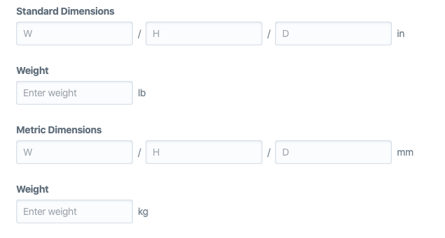
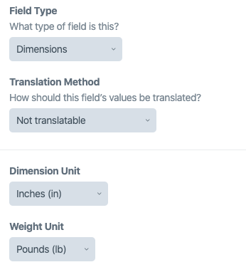

<p align="center"></p>

# Dimensions plugin for Craft CMS

Replicate the Craft Commerce Dimensions fields as a standalone field type.





## Requirements

This plugin requires Craft CMS 3.0.0-RC1 or later.

## Installation

To install the plugin, follow these instructions.

1. Open your terminal and go to your Craft project:

        cd /path/to/project

2. Then tell Composer to load the plugin:

        composer require viget/craft-dimensions

3. In the Control Panel, go to Settings → Plugins and click the “Install” button for Dimensions.

## Usage

If you have a field named `dimensions` you can access the following attributes (depending on the field settings):

```twig
dimensions.width
dimensions.height
dimensions.depth
dimensions.width
```
